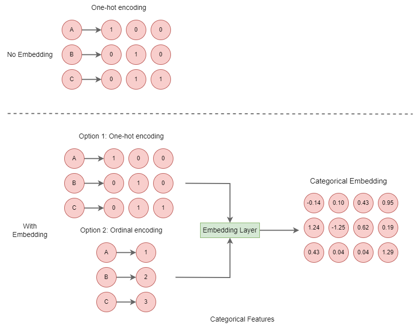
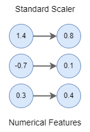

## Datasets

This directory contains the datasets used in the paper. The datasets are retrieved from [Tabular benchmark categorical classification](https://www.openml.org/search?type=benchmark&study_type=task&id=334) and [Tabular benchmark numerical classification](https://www.openml.org/search?type=benchmark&study_type=task&id=337) on [OpenML](https://www.openml.org/)

### How to choose the datasets

The datasets are chosen based on the following criteria:

- The dataset can be used for a classification task
- The dataset has at least 5000 instances
- The dataset has at least 2 classes
- The total number of features (including after one-hot-encoding of categorical features) < 5000

### Dataset description

#### Adult - Mixed, 10s of features

The dataset is a classification task to predict whether income exceeds $50K/yr based on census data. The dataset has 48842 instances and 15 features. The dataset has 2 classes. The dataset is retrieved from [Adult](https://www.openml.org/d/1590) on [OpenML](https://www.openml.org/)

#### Electricity - Numerical only, 0s of features

The dataset is a classification task to predict the class of a power plant based on the collected features. The dataset has 45312 instances and 9 features. The dataset has 2 classes. The dataset is retrieved from [Electricity](https://www.openml.org/d/151) on [OpenML](https://www.openml.org/)


#### Higgs - Numerical only, 10s of features

The dataset is a classification task to predict whether a given particle is a Higgs boson or not based on the collected features. The dataset has 98050 instances and 28 features. The dataset has 2 classes. The dataset is retrieved from [Higgs](https://www.openml.org/d/23512) on [OpenML](https://www.openml.org/)

#### KDDCup09_appetency - Mixed, 100s of features

The dataset is a classification task to predict the probability that a customer will buy a product. The dataset has 50000 instances and 230 features. The dataset has 2 classes. The dataset is retrieved from [KDDCup09_appetency](https://www.openml.org/d/1114) on [OpenML](https://www.openml.org/)


#### Mushroom - Categorical only, 10s of features

The dataset is a classification task to predict whether a mushroom is edible or poisonous based on the collected features. The dataset has 8124 instances and 22 features. The dataset has 2 classes. The dataset is retrieved from [Mushroom](https://www.openml.org/d/24) on [OpenML](https://www.openml.org/)


### Data profile

The data profile of the datasets is shown in the following table:

| Dataset | #instances | #features | #classes | #numerical features | #categorical features |
| --- | --- | --- | --- | --- | --- |
| Adult | 48842 | 15 | 2 | 6 | 9 |
| Electricity | 45312 | 9 | 2 | 9 | 0 |
| Higgs | 98050 | 28 | 2 | 28 | 0 |
| KDDCup09_appetency | 50000 | 230 | 2 | 190 | 40 |
| Mushroom | 8124 | 22 | 2 | 0 | 22 |

### Data preprocessing

The data preprocessing is done using the following steps:

1. Handle missing values or repeated values
    - Remove the features with more than 50% missing values
    - Remove the features with zero variance
    - Remove rows with missing values
2. Feature Engineering
    - One-hot-encoding for categorical features, then if the models have embedding layers, the one-hot-encoded features are converted to embedding features. In order to control the consistency of the encoding on different models, we select option 1 in the following figure:
    
    - Standardization for numerical features
    


3. Split the dataset into training set and test set
    - Training set: 70% of the dataset
        - The training set is used for training the models.
    - Validation set: 10% of the dataset
        - The validation set is used for tuning the hyperparameters of the models.
    - Test set: 20% of the dataset
        - The test set is used for evaluating the performance of the models.

    The dataset is split using the following code:
    ```python
    from sklearn.model_selection import train_test_split
    X_train, X_test, y_train, y_test = train_test_split(X, y, test_size=0.2, random_state=42)
    X_train, X_val, y_train, y_val = train_test_split(X_train, y_train, test_size=0.125, random_state=42)
    ```

4. Save the preprocessed dataset to a file
    - The preprocessed dataset is saved to a file in the following format:
        - The first line is the header of the dataset
        - The following lines are the instances of the dataset
        - The values are separated by comma
    - The preprocessed dataset is saved to the following path:
        - `data/<dataset_name>/preprocessed/<dataset_name>.csv`


#### Inputs of the models & adversarial attacks

The inputs of the models are the processed datasets. The adversarial attacks are applied on the one-hot-encoded features and standardization features. 
