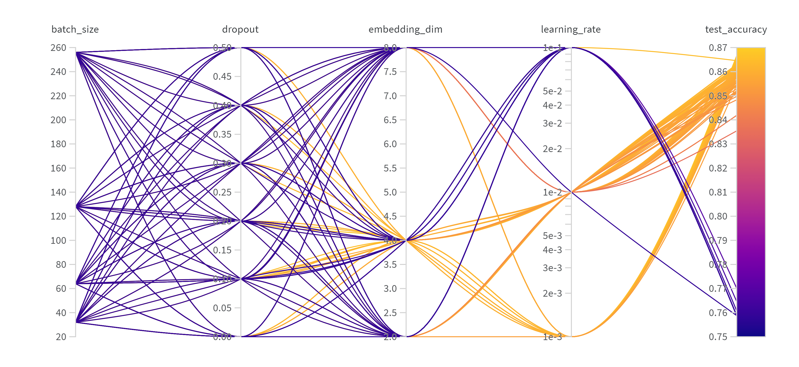
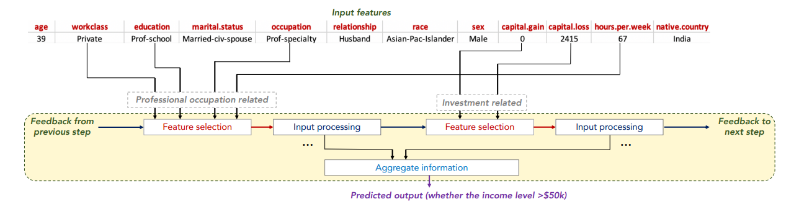
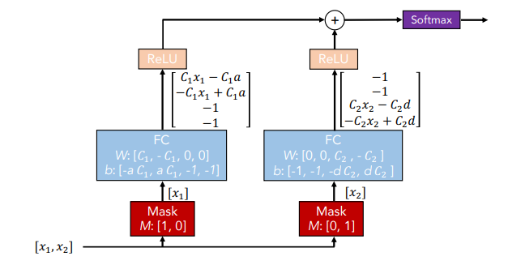
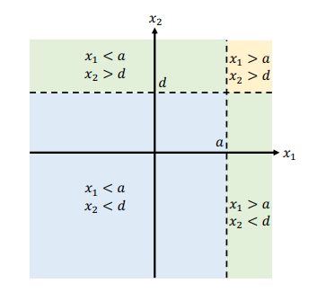
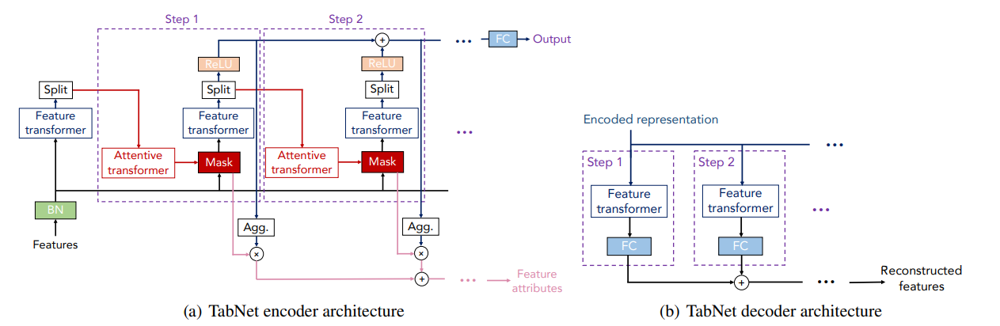
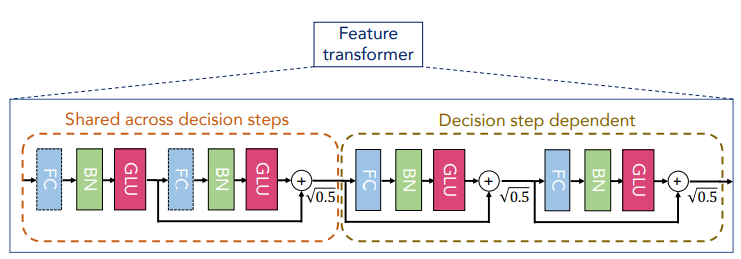
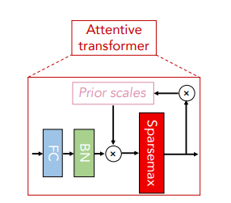
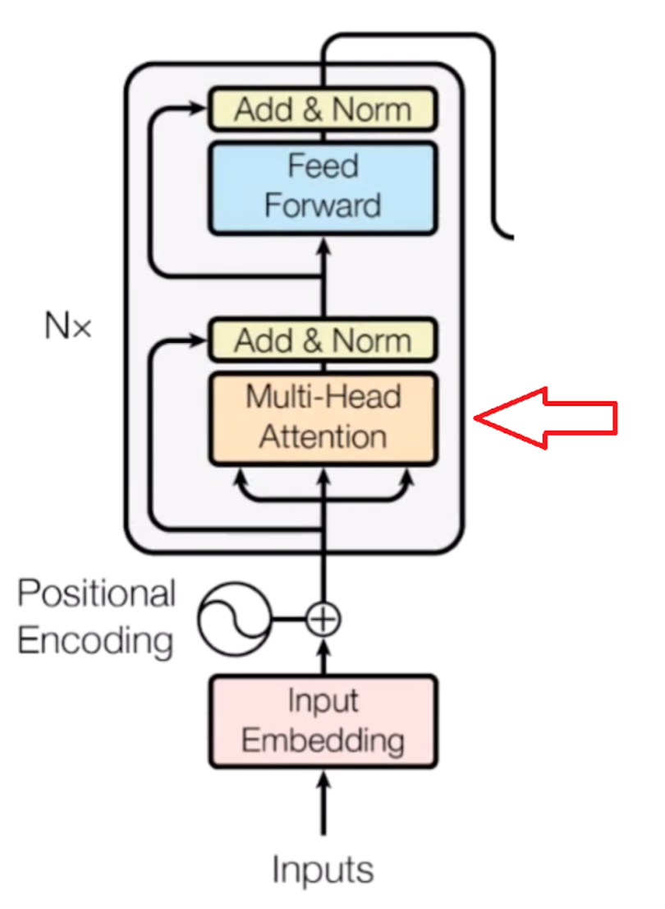
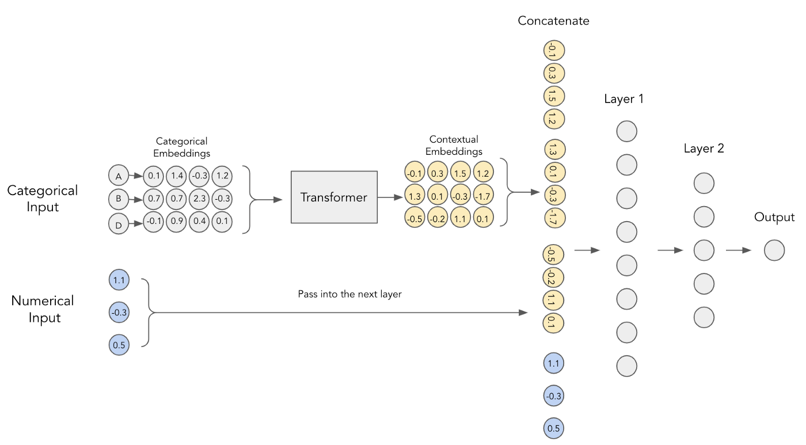
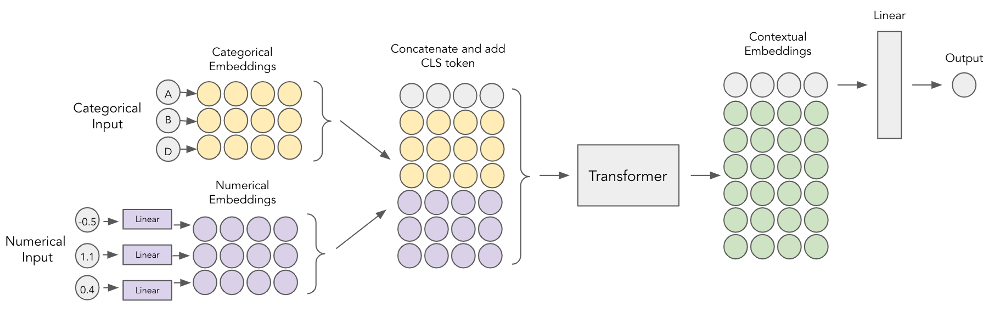

## Predictive Models

This directory contains the predictive models used in the project. 

We include JAX-based implementations of the following models in folder `models/jax`:

- Logistic Regression

We also include PyTorch-based implementations of the following models in folder `models/pytorch`:

- MLP
- TabNet
- Tab-Transformer
- FT-Transformer

We also include TensorFlow-based implementations of the following models in folder `models/tensorflow`:

- ...

We also include tree-based models in folder `models/tree`:

- XGBoost

### Logistic Regression

The logistic regression model is implemented in `models/jax/logistic_regression.py`. We do not use sklearn's implementation because the solver of sklearn's implementation because two of adversarial attacks toolkits in the state-of-the-art (foolbox and cleverhans) do not support sklearn's implementation. Hence, we implement our own version of logistic regression using JAX.

Here is the hyperparameters used for the logistic regression model:

```python
learning_rate = [0.001, 0.01, 0.1]
epochs = 20
penalty = [None, 'l2', 'l1', 'elasticnet']
alpha = [0.001, 0.01, 0.1, 1.0, 10.0]
```

### MLP

The MLP model is implemented in `models/pytorch/mlp.py`. The MLP model is a simple feed-forward neural network with 4 hidden layers with dimension 128, 64, 32, 16. The activation function is ReLU. The output layer is a linear layer. The dropout is applied to the hidden layers. The optimizer is Adam. The loss function is Binary Cross Entropy. 

We use the wandb sweep to search for the best hyperparameters for the MLP model. Here is the hyperparameters used for the MLP model:

```python
    # Sweep: mzr1b2ww
    parameters_dict = {
        'epochs': {
            'values': [20]
            },
        'optimizer': {
            'values': ['adam']
            },
        'dropout': {
            'values': [0.0, 0.1, 0.2, 0.3, 0.4, 0.5]
            },
        'embedding_dim': {
            'values': [2, 4, 8]
            },
        'learning_rate': {
            'values': [0.001, 0.01, 0.1]
            },
        'batch_size': {
            'values': [32, 64, 128, 256]
            },
        }
```

The results of the wandb sweep is shown below:
Best test accuracy will above 0.86. The figure shows that the batch size and dropout rate do not have a significant impact on the test accuracy. The learning rate and embedding dimension have a significant impact on the test accuracy. The best test accuracy is achieved when the learning rate is 0.001 and the embedding dimension is 4.



I select the following hyperparameters for the MLP model:

```python
    # Sweep: mzr1b2ww
    # Run: lively-sweep-184
    parameters_dict = {
        'epochs': {
            'values': [20]
            },
        'optimizer': {
            'values': ['adam']
            },
        'dropout': {
            'values': [0.2]
            },
        'embedding_dim': {
            'values': [4]
            },
        'learning_rate': {
            'values': [0.001]
            },
        'batch_size': {
            'values': [256]
            },
        }
```


### TabNet

TabNet is a deep learning model for tabular data. It is based on the paper [TabNet: Attentive Interpretable Tabular Learning](https://arxiv.org/abs/1908.07442) by Sercan O. Arik and Tomas Pfister.

#### TabNet Architecture

1. **Sparse feature selection**: TabNet can be trained to enforce feature selection and sparsity, which can improve model interpretability and reduce overfitting on noisy or irrelevant features.



Then, the selected features are grouped into blocks of features. Each block of features is fed into a decision step. Here is a DT-like classification example: 



Each decision step will output a decision feature vector. The decision feature vectors are then fed into a shared decision step. The shared decision step will output the final prediction.



2. **TabNet Attention**: TabNet uses a specialized attention mechanism called "TabNet Attention" that focuses on selecting relevant features for each decision step in the model. This attention mechanism helps TabNet learn which features are most important for making accurate predictions.



The feature transformer is used for processing features. TabNet does not require manual feature engineering. It can automatically learn relevant interactions between features, making it capable of discovering complex patterns in tabular data.



TabNet uses its attention mechanism to select important features at each decision step. This means it dynamically determines which features are most relevant for making predictions and focuses on those features. Features that are less relevant receive lower attention scores and may be effectively ignored during the modeling process.



3. **Feature Importance Scores**: TabNet can provide feature importance scores, which indicate the contribution of each feature to the model's predictions. This can be valuable for understanding the model's decision-making process and identifying important features in your dataset.

The TabNet model is implemented in `models/pytorch/tabnet.py`. We use the implementation from [Dreamquark-ai]().


### Tab-Transformer

Tab-Transformer is a deep learning model for tabular data. It is based on the paper [TabTransformer: Tabular Data Modeling Using Contextual Embeddings](https://arxiv.org/abs/2012.06678) by Wei Cao, et al.

**How Transformer work**:

1. Calculating the importance of each element in a sequence with a self-attention mechanism.
2. Combining these weighted elements to get the attention output.
3. Using multiple "heads" of attention to capture different relationships.
4. Adding this output to the original input via a residual connection.
5. Passing the result through a feed-forward neural network.
6. Repeating this process in a stacked fashion to form deep Transformer models for various tasks.






### FT-Transformer

1. **Numerical Embeddings**: Traditional TabTransformer takes categorical embeddings and passes them through the Transformer blocks to transform them into contextual ones. Then, numerical features are concatenated with these contextual embeddings and are passed through the MLP to get a prediction.

The embeddings that the FT-Transformer uses are linear, meaning that each feature gets transformed into dense vector after passing through a simple fully connected layer. It should be noted that these dense layers don’t share weights, so there’s a separate embedding layer per numeric feature.


2. **CLS Token**: The usage of CLS token is adapted from NLP domain but it translates quite nicely to the tabular tasks. The basic idea is that after we’ve embedded our features, we append to them another “embedding” which represents a CLS token. This way, categorical, numerical and CLS embeddings get contextualised by passing through the Transformer blocks. Afterwards, contextualised CLS token embedding serves as an input into a simple MLP classifier which produces the desired output.

By augmenting TabTransformer with numerical embeddings and CLS token, we get the final proposed architecture.



### XGBoost

XGBoost is a tree-based ensemble machine learning algorithm that uses a gradient boosting framework. It is based on the paper [XGBoost: A Scalable Tree Boosting System](https://arxiv.org/abs/1603.02754) by Tianqi Chen, et al. The implementation of XGBoost is from [XGBoost](https://xgboost.readthedocs.io/en/latest/).

